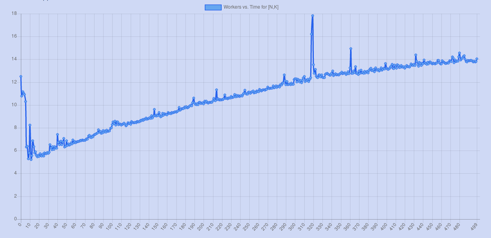
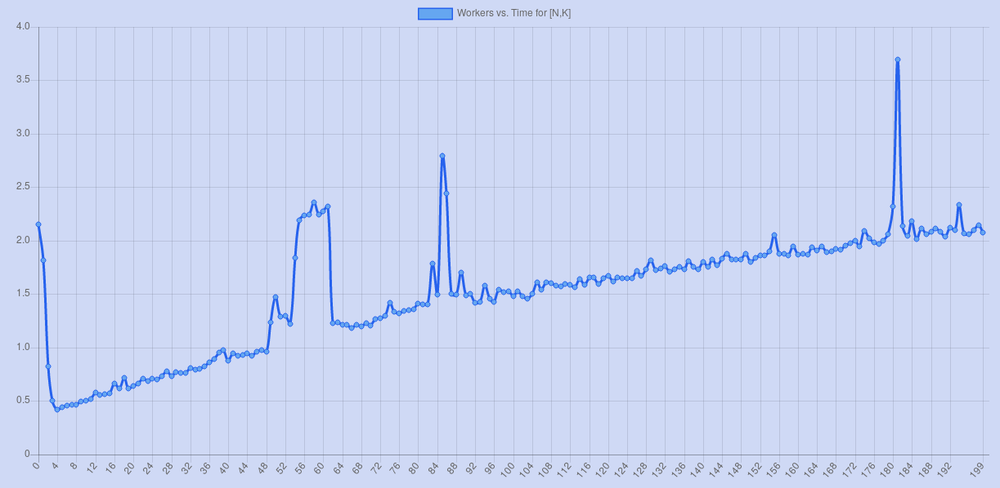

## Squares

The purpose of this app is to examine the relationship between the performance of a concurrent program and the number of threads being that it's using. The program in the back end (written in Elixir) accepts a problem size defined by the user and replicates its execution over an increasing number of threads, observing the elapsed time over each iteration. After execution, the problem's output (a list of pairs of perfect squares, more details below) is returned along with a [Chart.js](https://www.chartjs.org) line graph plotting number of threads vs. execution time. 

### Perfect Square Problem 
So what exactly are the threads working together to solve? In summary, they are determining if the sum of a list of consecutive squares is itself a perfect square. The user provides two values: a range `N` and a length `k`. The program will calculate the sum of squares of each list of squares of consecutive integers of length `k` starting at 1 and ending at `N`. If the sum of squares of a list happens to be a perfect square as well, that list is marked and its starting value (and sum of squares) is returned.

For example, consider this user input: `[N, k]` = [3, 2]

The program would compute the sum of squares of all consecutive lists of starting between 1 and 3 of length 2:

[1, 2] -> 12 + 22 = 5

[2, 3] -> 22 + 32 = 13

[3, 4] -> 32 + 42 = 25

Only the third list produces a perfect square, and for that reason only the pair {3, 25} would be returned as a valid result. Knowing that the provided value for `k` was 2, this pair would suggest that summing the squares of 2 consecutive integers beginning with 3 will return 25, a perfect square. Other example pairs that produce legitimate perfect squares are `[100, 49]` and `[200, 289]`. Try them out!

NOTE: Even if the `[N, k]` pair provided by the user does not return any valid perfect sums of squares, the program will still execute and return the chart plotting the number of nodes vs. execution time.

### Example Results
A pattern that is commonly observed over many inputs is that using slightly more than one thread gives better performance than using only one thread. This seems obvious - splitting the work among multiple threads would make execution faster than using no concurrency at all. However, after increasing the number of workers past a certain point, the elapsed time creeps back up to the level of using only one node because of the overhead of executing so many threads at once. The following example plots illustrate this pattern.

### Running

  * Install dependencies with `mix deps.get`
  * Install Node.js dependencies with `cd assets && npm install`
  * Start Phoenix endpoint with `mix phx.server`

Now you can visit [`localhost:4000`](http://localhost:4000) from your browser.

Instructions and requirements for running Elixir and Phoenix projects [can be found here](https://elixir-lang.org/docs.html).

### TODO

* Make positive results (squares) appear on screen after query
  * Display clearly in an HTML dynamic table
* Finish HTML: add description, instructions, color, etc.
* Fix Up Chart.js: Axis Labels, actual [N,k] values in title
* Add Unit Tests
* Refactor: throw out unused code, comment, etc.
* Refactor: relocate channel methods to backend for mobile portability

